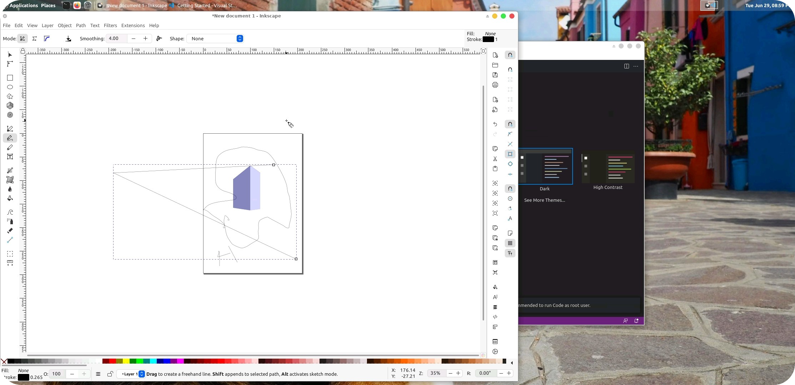

# 🐧 udroid

## Ubuntu-21.04 on android

Ubuntu-on-android aims to run ubuntu with pre-installed Desktop Environment, development tools, and software on top of android without root with the help of proot in termux application. This project is just like any other Linux on android projects but with aim of making it easy for end-user on setting up Linux.

  

codename = `udroid`

### Supported arch status

| arch   | status                                                              |
| ------ | ------------------------------------------------------------------- |
| arm64  |       |
| armv7l |       |
| amd64  |                   |
| armv8l |  |
| Others | `not started`                                                       |

### Some Screenshot

 .png>) .jpg>)

### Developers & credits

DEV #0 = [Saicharankandukuri](https://github.com/SaicharanKandukuri)



Dev #1 = [SlimSam](https://github.com/slimsam4u)



### License

MIT Copyright (c) 2021 Saicharan Kandukuri


[quick-installation-and-usage.md](udroid-landing/quick-installation-and-usage.md)

