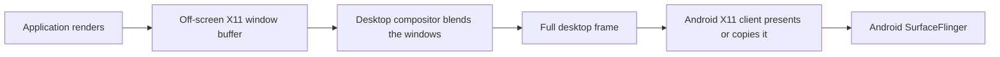
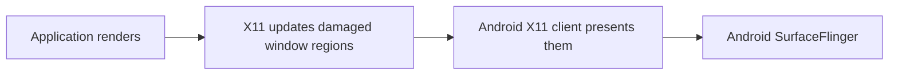

# Smooth desktop performance

## Quick fix

If moving windows, opening menus, or scrolling feels slow, disable desktop
compositing first.

For XFCE, open a terminal **inside the running desktop** and use:

```bash
xfconf-query \
  -c xfwm4 \
  -p /general/use_compositing \
  -s false
```

You can also open **Settings → Window Manager Tweaks → Compositor** and turn
off **Enable display compositing**.


The window manager remains active. Windows can still be moved, resized,
maximized, and switched. Only the extra compositing stage and effects such as
shadows and transparency are disabled.


### Touch-friendly XFCE launch

On a phone-sized display, start XFCE with larger GTK, Qt, and pointer scaling:

```bash
export DISPLAY=:0
export XDG_SESSION_TYPE=x11
export GDK_BACKEND=x11
export GDK_SCALE=2
export QT_SCALE_FACTOR=2
export XCURSOR_SIZE=48

dbus-run-session -- startxfce4
```

If `dbus-run-session` is missing on Ubuntu or Debian:

```bash
apt update
apt install dbus-x11
```

Use a scale of `1` instead of `2` on a tablet, external display, or whenever
the interface becomes too large.

## Which desktop should I use?

For a rootless X11 desktop on Android:

| Priority | Recommended desktop | Why |
| --- | --- | --- |
| Responsive desktop and low overhead | **XFCE without compositing** | It avoids an unnecessary full-screen composition stage and is easy to scale for touch. |
| Most complete touch-first interface | **GNOME** | It has system-wide touchscreen gestures and an on-screen keyboard, but GNOME Shell requires its Mutter compositor and is substantially heavier. |
| Touch mode and extensive customization | **KDE Plasma** | Plasma can enlarge interface elements for touch, but KWin compositing is more demanding on an incomplete or copy-based X11 presentation path. |

XFCE does not provide GNOME-style system gestures. Applications can still
receive touchscreen and multitouch events when the Android X11 client and X
server expose them.

## Why disabling compositing helps

Rendering an application and displaying its window are separate operations.
On a conventional Linux desktop, DRM, GBM, DMA-BUF, explicit synchronization,
and a GPU compositor can make the final composition nearly zero-copy.

Rootless Android X11 environments do not always provide that complete path.
A composited frame can instead travel through several stages:



If DMA-BUF sharing, GPU import, or release fences are unavailable, one or more
of those stages may become a CPU copy. The compositor may also redraw most of
the screen for a small menu, cursor, or window movement.

With compositing disabled, the shorter route is:



This removes an off-screen redirection and full-desktop blending stage. It
usually reduces:

* CPU usage and memory bandwidth
* buffer copies
* synchronization waits
* touch-to-display latency
* stutter while moving windows or opening menus


A smoother non-composited desktop does not prove that GPU acceleration is
working. It may simply mean that the system is doing much less presentation
work.


## Trade-offs

Keep compositing disabled when responsiveness matters more than visual
effects. Depending on the desktop and X11 server, you may lose:

* shadows, transparency, blur, and some animations
* live window previews and overview effects
* compositor-controlled tear prevention

You may see tearing during video playback or fast scrolling. If that happens,
compare the result with compositing enabled rather than assuming either mode
is universally better.

## Re-enable XFCE compositing

Run this from a terminal inside the same XFCE session:

```bash
xfconf-query \
  -c xfwm4 \
  -p /general/use_compositing \
  -s true
```

Re-enable it when the Android X11 path can import the desktop buffers directly,
synchronize them correctly, and present the compositor's final frame without
an expensive CPU copy.

## Common problems

### `Failed to init libxfconf`

Run `xfconf-query` from a terminal opened inside XFCE. A separately launched
PRoot or ADB shell may not have the desktop session's D-Bus address and
authentication context. Use the graphical Window Manager Tweaks setting if the
command still fails.

### `Another compositing manager is running`

Only one compositor can own an X11 screen. Stop the old desktop session or
restart the X11 display before starting another compositor.

### How to compare both modes

Use the same display resolution and applications, then:

1. Move a large window continuously for ten seconds.
2. Open and close a menu repeatedly.
3. Scroll a long page while watching touch response.
4. Compare CPU usage with `top`.

`glxgears` can confirm that frames are being produced, but it is not a reliable
desktop-performance benchmark.

## Further reading

* [GNOME touchscreen gestures](https://help.gnome.org/gnome-help/touchscreen-gestures.html)
* [KDE Plasma Touch Mode](https://docs.kde.org/stable_kf6/en/plasma-desktop/kcontrol/workspaceoptions/workspaceoptions.pdf)
