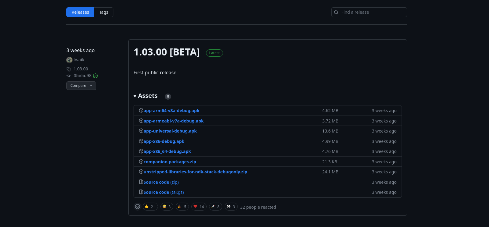

# setting up termux-x11

termux-x11 is a termux addon providing Android frontend for xwayland. It uses the Wayland display protocol, which is aimed to become the successor of the X Window System. Note that it is not a fully-fledged Wayland server, it's like an X system in Wayland.

### 1. How does it work?

Through its companion package, the executable creates a socket through $XDG\_RUNTIME\_DIR in the Termux directory by default.

The Wayland sockets are the way for the graphical applications to communicate with. Termux X11 applications do not have Wayland support yet, this kind of setup may not be straightforward and therefore additional packages should be installed in order for X11 applications to be run in termux-x11.

### 2. Requirements

* Termux from [f-droid](https://f-droid.org/en/packages/com.termux/) or [termux-dev builds](https://github.com/termux/termux-app/actions/workflows/debug\_build.yml)
* termux-x11 app from [GitHub releases page](https://github.com/termux/termux-x11/releases)
  *

      <figure><figcaption></figcaption></figure>


### 3. Setup Instructions

First, we need to set `x11-repo` and then to install `termux-x11-nightly`. These commands below do the job of installing both of them. execute these commands in termux-app ( copy, paste, then enter )

```bash
apt install x11-repo -y
apt install termux-x11-nightly -y
```

### 4. Starting `termux-x11` app

Start the termux-x11 app and use this command in termux to start the x11 server

```bash
termux-x11 :0 &
```


`:0` is the display number and `&` is used to stop termux-x11 from locking the terminal


### 5. Using termux-x11 with UDROID

udorid launch script takes care of mounting the termux-x11 default socket directory to the suites tmp directory, you just have to export the **DISPLAY** variable to the correct display address and run the application/Desktop environment to show the GUI in termux-x11

Login to your distro and try out these examples

### Examples

#### Staring `glxgears`

```bash
export DISPLAY=:0
glxgears
```

#### Staring `xfce4`

```bash
export DISPLAY=:0
startxfce4
```

#### Staring `gnome`

```bash
export DISPLAY=:0
export XDG_CURRENT_DIR=GNOME

# PATH GNOME issue with proot
for file in $(find /usr -type f -iname "*login1*"); do mv -v $file "$file.back"; done

service dbus start
gnome-shell --x11
```


Sometimes you may need further tweaks to make program run termux-x11

it may be options, environment variables and etc...


### termux-x11 repo


