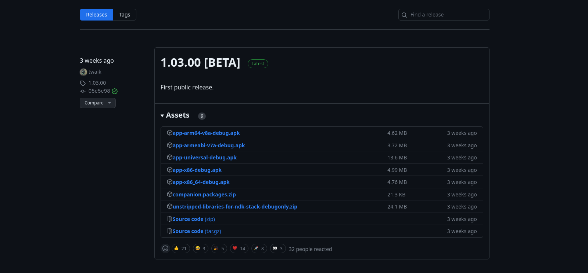

# setting up termux-x11

Termux:X11 is the official Termux X server add-on for Android. It is a fully
fledged X server and consists of two parts: the Termux:X11 Android app and its
companion Termux package.

This guide covers the official
[termux/termux-x11](https://github.com/termux/termux-x11) project used with a
uDroid distribution.

### 1. How does it work?

The companion package starts the Termux:X11 server and creates the X11 socket.
Linux graphical applications connect to that socket using the display address
in the `DISPLAY` environment variable. The Android app displays the X server's
output and handles Android-side input.

### 2. Requirements

* Termux from [f-droid](https://f-droid.org/en/packages/com.termux/) or [termux-dev builds](https://github.com/termux/termux-app/actions/workflows/debug\_build.yml)
* termux-x11 app from [GitHub releases page](https://github.com/termux/termux-x11/releases)
  *

      <figure><figcaption></figcaption></figure>


### 3. Setup Instructions

First, we need to set `x11-repo` and then to install `termux-x11-nightly`. These commands below do the job of installing both of them. execute these commands in termux-app ( copy, paste, then enter )

```bash
apt install x11-repo -y
apt install termux-x11-nightly -y
```

### 4. Starting `termux-x11` app

Start the termux-x11 app and use this command in termux to start the x11 server

```bash
termux-x11 :0 &
```


`:0` is the display number and `&` is used to stop termux-x11 from locking the terminal


### 5. Using termux-x11 with UDROID

udorid launch script takes care of mounting the termux-x11 default socket directory to the suites tmp directory, you just have to export the **DISPLAY** variable to the correct display address and run the application/Desktop environment to show the GUI in termux-x11

Login to your distro and try out these examples

### Examples

#### Staring `glxgears`

```bash
export DISPLAY=:0
glxgears
```

#### Staring `xfce4`

```bash
export DISPLAY=:0
startxfce4
```


If XFCE starts but moving windows, opening menus, or scrolling feels slow,
disable its compositor. See
[Smooth Termux:X11 desktop performance](smooth-desktop-performance.md) for the quick fix,
touch-friendly scaling, and the reason this helps on Android.


#### Staring `gnome`

```bash
export DISPLAY=:0
export XDG_CURRENT_DIR=GNOME

# PATH GNOME issue with proot
for file in $(find /usr -type f -iname "*login1*"); do mv -v $file "$file.back"; done

service dbus start
gnome-shell --x11
```


Sometimes you may need further tweaks to make program run termux-x11

it may be options, environment variables and etc...


### termux-x11 repo


